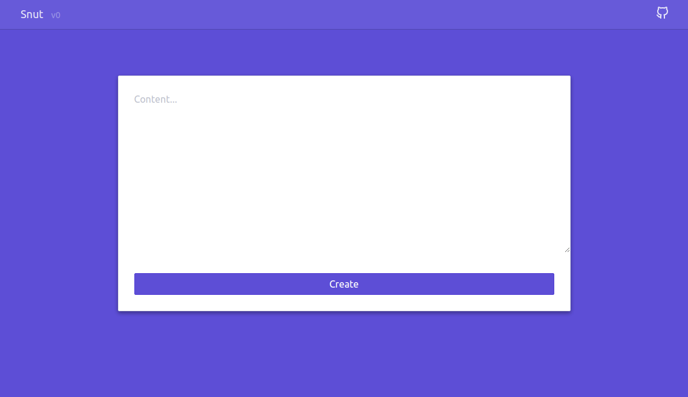

# Snut

Another pastebin with a clean and minimalist ui. Made for selfhosting.

Disclamer: still WIP



## Features and roadmap

Unordered list of future features

- [x] Auto delete after time period
- [x] Set env variables for config
- [ ] Add a favicon
- [ ] Create a logo
- [ ] Docker image
- [ ] DB encryption
- [ ] Different db adapters
- [ ] Setup a demo instance
- [ ] Limit content size
- [ ] Global (admin) password to acces the app
- [ ] Og social images

Concerning the code

- [ ] Params validation
- [ ] Setup a linter
- [ ] Better code splitting
- [ ] Add a proper logger

## Contribute

**Pull requests are welcome !** Feel free to contribute.

To contribute to this project, first clone this repo

```bash
git clone git@github.com:cauctus/projo.git
```

Then install the dependencies

```bash
npm i
```

Then start the dev server

```bash
npm run dev
```

## Credits

Coded with ❤️ by [Corentin Thomasset](https://github.com/CorentinTh).

## License

This project is under the [MIT license](LICENSE).
